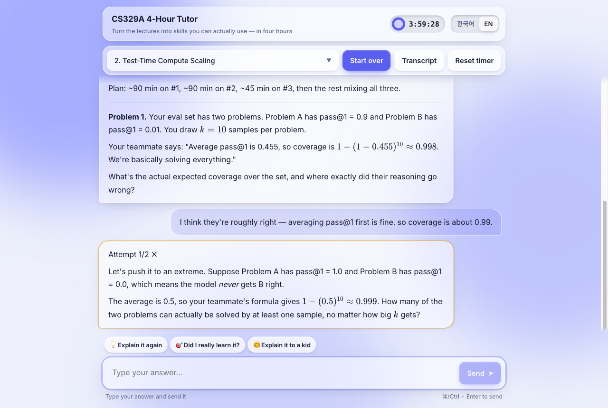
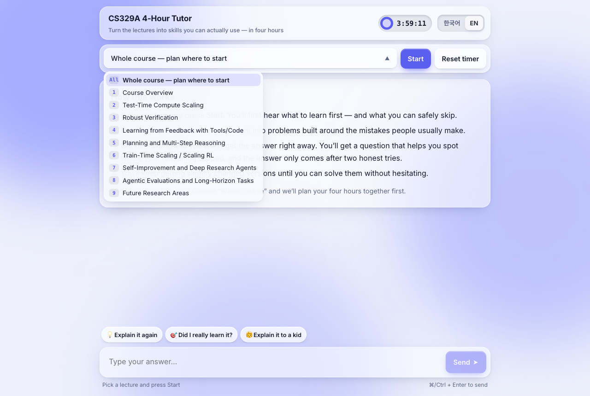
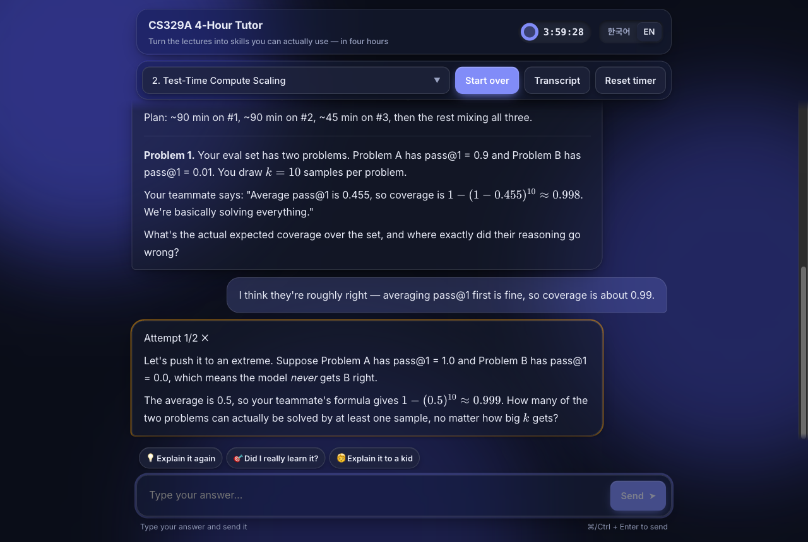
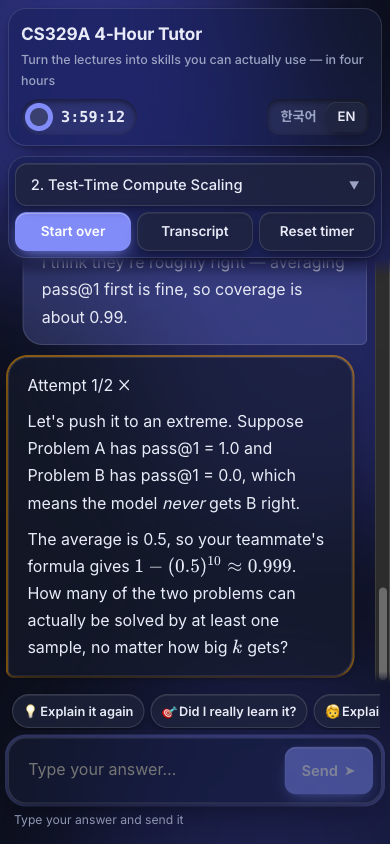

# CS329A 4-Hour Tutor

A local web tutor that turns the nine lectures of **Stanford CS329A — Self-Improving AI Agents** ([YouTube playlist](https://www.youtube.com/watch?v=6YnLB0XbTnI&list=PLangBM27OtEA)) into skills you can actually use, in a single four-hour session.

It doesn't lecture you. It works Socratically: it drops you straight into situations where people usually get things wrong, answers your mistakes with questions instead of answers, and only reveals an answer after two honest attempts.

It runs on **Claude Code in headless mode** (`claude -p`), so it needs no API key. It uses the Claude Code account you're already logged into.



## Screenshots

| Start screen and lecture picker | Dark mode |
|---|---|
|  |  |

<p align="center"></p>

## Quick start

```bash
# 1. Build the lecture transcripts (not committed — see "Transcripts" below)
pip install youtube-transcript-api
python3 fetch_transcripts.py

# 2. Run the tutor (standard library only)
python3 server.py        # → http://localhost:8329
```

Requirements: Python 3.10+ and [Claude Code](https://claude.com/claude-code), installed and logged in.

## How a session works

1. **Pick a lecture, then press Start.** You can also pick *Whole course*, and the tutor will first plan how to spend your four hours across all nine lectures.
2. **Triage first.** The tutor tells you:
   - the 2–3 things to learn first, in order
   - what you can safely ignore
   - one exercise that, done just once, puts you ahead of 70% of people who've been studying for months
3. **Straight into problems.** No concept explanations. You get one concrete scenario at a time, built around a common mistake.
4. **Wrong answers get questions, not answers.** A counterexample, an edge case, a "what if…?". Each miss is marked `Attempt k/2 ✗`, and the answer only comes after two failed attempts.
5. **Right answers get variations.** You keep getting variations with new traps until you answer without hesitating. A correct answer with wrong reasoning doesn't count.
6. **The clock matters.** The remaining time is sent with every message. Under 30 minutes, the tutor focuses on locking in the single most important skill. At zero, it wraps up with a three-line checklist.

### Study options

Three buttons above the input box send ready-made prompts. The blanks are filled in automatically.

| Button | What it does |
|---|---|
| 💡 **Explain it again** | Finds the one sentence that unlocks the text, explains it with an everyday analogy and no jargon, then asks three questions. It won't move on until you answer all three. The text is whatever you pasted into the input box, or the tutor's last reply if the box is empty. |
| 🎯 **Did I really learn it?** | Five deceptively simple questions that expose shallow understanding. After each answer you get blunt feedback on the gaps in your fundamentals. |
| 🧒 **Explain it to a kid** | You explain the topic to a "ten-year-old". The tutor stops you on jargon, skipped steps, or oversimplifications, then tells you what those slips reveal about what you don't fully understand yet. |

### Interface

- **Korean / English.** One toggle switches the UI, the lecture names, and the tutor's language. If you switch mid-conversation, the tutor immediately restates the current problem in the new language.
- **Rendering.** Tutor replies render Markdown and math (KaTeX).
- **Persistence.** The conversation, the selected lecture, and the four-hour timer survive a page reload.
- **Transcript pages.** *Transcript* opens the lecture's captions as readable paragraphs, with clickable timestamps that jump into the video and full-text search.
- **Look and feel.** Monochrome glassmorphism with tactile press feedback and small motion details. It follows light/dark mode, works on mobile, and respects `prefers-reduced-motion`.

## How it works

```
browser (index.html) ──POST /api──▶ server.py ──stdin──▶ claude -p --safe-mode --tools "" \
                                                          --system-prompt-file .tutor/system_N.txt \
                                                          --session-id <uuid>  |  --resume <uuid>
```

- **System prompt.** `server.py` builds one system prompt per lecture: the tutoring rules plus that lecture's full transcript. The *Whole course* option uses all nine lectures, about 130k tokens.
- **Sessions.** The first message creates a Claude Code session, and every later message resumes it, so Claude Code keeps the history. The browser only stores the session id.
- **Isolation.** `--safe-mode` keeps your personal CLAUDE.md, hooks, plugins, and MCP servers out of the tutor. `--tools ""` disables tools, so it answers only from the transcript. Sessions live under `.tutor/`, separate from your normal Claude Code history.
- **Input handling.** Messages go to `claude` over stdin, so an answer that starts with `--` can't be read as a CLI flag.

## Files

| File | Purpose |
|---|---|
| `server.py` | Local HTTP server: serves the UI and runs `claude -p` per message |
| `index.html` | The tutor UI (chat, timer, lecture picker, study options, i18n) |
| `ui.css` | Shared theme for the tutor and the transcript pages |
| `transcript.js` | Language toggle and search on the transcript pages |
| `fetch_transcripts.py` | Downloads the captions and builds `1_*.html` … `9_*.html` |

## Transcripts

The lecture videos and their captions belong to Stanford, so the transcript pages are **not committed**; they're git-ignored. `fetch_transcripts.py` rebuilds them from YouTube's English captions:

- Caption fragments are joined into paragraphs at sentence boundaries.
- No words are changed.

The captions are auto-generated, so expect occasional typos. The tutor is told to correct them from context.

## Notes

- **Usage.** Each message counts against your Claude Code usage, not API billing. *Whole course* sends a large context on every turn, so it uses your allowance faster than a single lecture.
- **Speed.** A reply can take tens of seconds.
- **Internet.** Markdown/math rendering and fonts load from CDNs. Offline, replies fall back to plain text, but `claude -p` needs the internet anyway.
